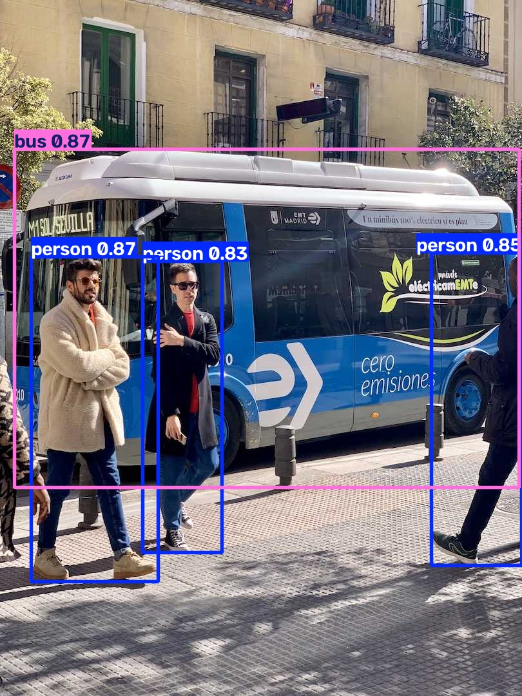

# 🚀 SpotBox - Real-Time Object Detection API



SpotBox is a real-time object detection application built with **YOLOv8** and **Streamlit**. 
It allows you to upload an image, and the AI instantly detects people, vehicles, and other objects, drawing bounding boxes around them with confidence scores!

## 🌐 Live Demo

**Check out the live app here:** [SpotBox Live Demo](https://spotbox-7yfazduobvw8p7fpjaamrb.streamlit.app)

## ✨ Features

- **Instant Object Detection**: Uses YOLOv8 to accurately detect objects in images.
- **Interactive UI**: Built with Streamlit for a clean, user-friendly interface.
- **High Confidence Scores**: Displays the AI's confidence level for every detection.
- **Cloud Deployed**: 100% free to use and accessible anywhere in the world!

## 🛠️ Tech Stack

- **Python 3.10+**
- **Streamlit** (For the web interface)
- **Ultralytics YOLOv8** (The AI model)
- **OpenCV** (Image processing)

## 📦 Installation & Setup (Local)

1. **Clone the repository:**
   ```bash
   git clone https://github.com/yosefdev798/SpotBox.git
   cd SpotBox
